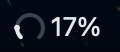
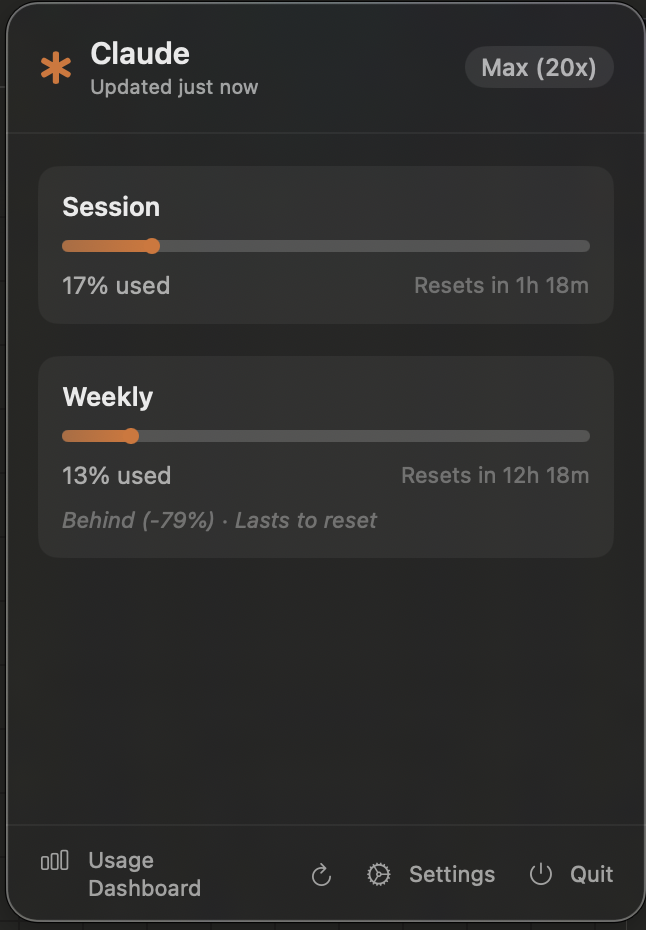

# ClaudeMeter

A native macOS menu bar app that tracks your Claude Pro/Max subscription usage in real time.

<p align="center">
  
  
</p>

## Features

- **Live gauge icon** in the menu bar that fills up as you use Claude
- **Session usage** (5-hour window) with reset countdown
- **Weekly usage** (7-day window) with reset countdown and pace indicator
- **Sonnet/Opus** model-specific tracking
- **Extra usage** spend tracking when enabled
- **Auto-refresh** every 60 seconds (configurable)
- **Launch at Login** support
- **Privacy-first** — everything runs locally, your session key never leaves your machine

## How it works

ClaudeMeter reads your `sessionKey` cookie from claude.ai and calls the same API endpoints that the Claude web app uses. No third-party servers involved.

### Endpoints used

- `GET /api/organizations` — your org UUID and plan info
- `GET /api/organizations/{orgId}/usage` — session, weekly, and model usage
- `GET /api/account` — email and plan details

## Install

### From source (recommended)

1. Clone this repo
2. Open in Xcode (File > Open > select the `ClaudeMeter` folder)
3. Build & Run (Cmd+R)
4. ClaudeMeter appears in your menu bar

### Requirements

- macOS 14.0+ (Sonoma or later)
- Xcode 15+
- Active Claude Pro or Max subscription

## Setup

1. Launch ClaudeMeter — a gauge icon appears in your menu bar
2. Click it and paste your `sessionKey`:
   - Open [claude.ai](https://claude.ai) in Chrome
   - Open DevTools (`Cmd+Option+I`)
   - Go to **Application** tab > **Cookies** > **claude.ai**
   - Copy the `sessionKey` value
   - Paste it in ClaudeMeter and click **Go**

The session key is stored locally in UserDefaults. You may need to re-paste it when it expires (roughly every 2 weeks).

## Building with Swift Package Manager

```bash
cd ClaudeMeter
swift build -c release
```

The binary will be in `.build/release/ClaudeMeter`.

## Settings

Open Settings from the popover footer:

- **Refresh interval** — 30s, 1m, 2m, or 5m
- **Show usage % in menu bar** — toggle the percentage text next to the gauge
- **Launch at Login** — start ClaudeMeter when you log in
- **Auto-Detect from Browser** — attempts to read Chrome/Firefox cookies automatically (requires Full Disk Access)

## Privacy

- Session key stored in UserDefaults on your Mac
- Only network calls are to `claude.ai`
- No analytics, no telemetry, no third-party services
- Open source — read every line

## Tech

- Swift 5.9+ / SwiftUI
- `MenuBarExtra` with `.window` style
- Custom Core Graphics gauge renderer for the menu bar icon
- `SMAppService` for Launch at Login
- `CommonCrypto` for Chrome cookie decryption (auto-detect feature)
- Zero dependencies

## Credits

Made by [Nikola Popovic](https://github.com/nikolapopovic) & [Nix](https://github.com/nikolapopovic/claudes-life).

Inspired by [CodexBar](https://github.com/steipete/CodexBar).

## License

MIT
